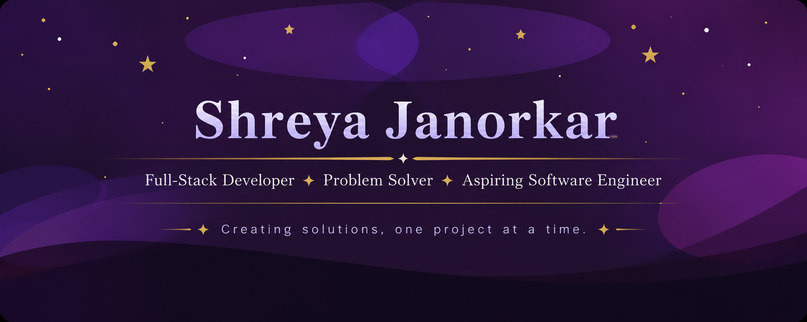

  

<b><h2>⚜️ ABOUT ME</h2></b>

Computer Science Engineering student passionate about building software and solving problems. Currently focused on MERN Stack development while strengthening Core Computer Science fundamentals.

✦ Full-Stack Development

✦ Data Structures & Algorithms

✦ Core Computer Science

Currently working on a CNN-based image classification project during a Summer Internship and project-based learning.

---

## ⚜️ TECH STACK

### ✦ Languages & Core

### ✦ Frontend

### ✦ Backend & Databases

### ✦ Tools

---

## ⚜️ GITHUB STATS

